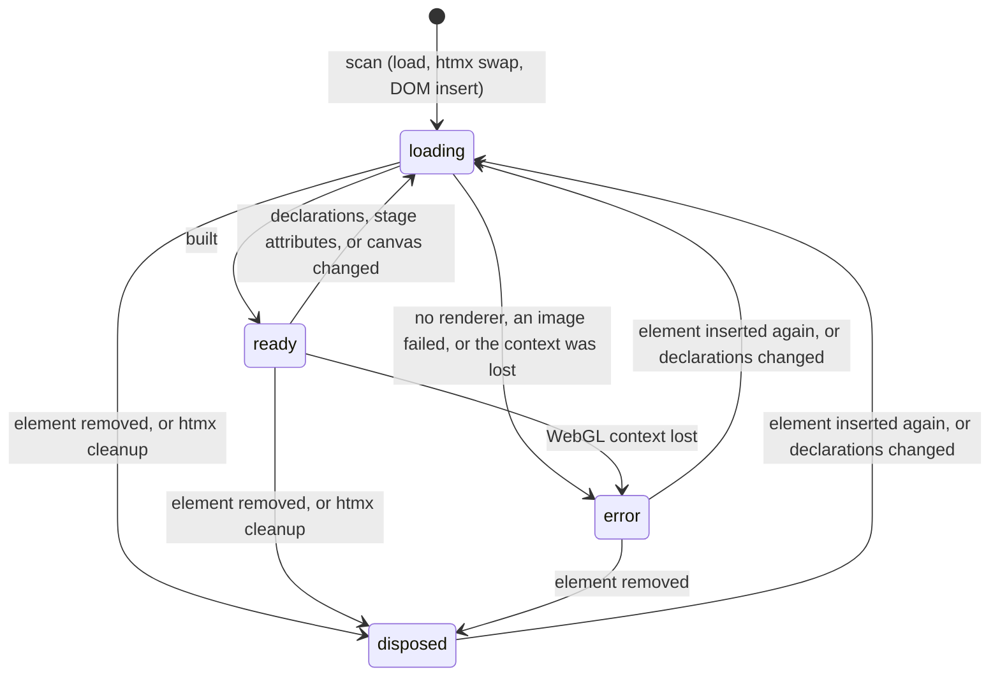

# autumn-plugin-pixijs

This plugin adds [PixiJS](https://pixijs.com) 2D canvas stages to
[Autumn](https://autumn-web.app) apps. It works with Maud and htmx. It does
not use npm, a bundler, or inline script. You write a stage in Rust or as
HTML attributes. A tap on a canvas object can send an htmx request.

- The crate contains PixiJS **8.22.0** (MIT license). A `sha384` hash locks
  each vendored file.
- The crate needs `autumn-web` **0.8** and Rust **1.88** or later.

## Quickstart

Add the plugin:

```rust
use autumn_plugin_pixijs::PixiPlugin;

autumn_web::app()
    .plugin(PixiPlugin::new())
    .run()
    .await;
```

Put the tags in the layout `<head>`. Put them before your own scripts.
Tap requests need htmx:

```rust
use autumn_plugin_pixijs::{pixi_script, pixi_stylesheet};
use autumn_web::assets::asset_url;

html! {
    head {
        (pixi_stylesheet())
        (pixi_script())
        script src=(asset_url("js/htmx.min.js")) defer {}
    }
}
```

Write a stage:

```rust
use autumn_plugin_pixijs::{Color, Shape, Stage, Text};

html! {
    (Stage::new()
        .label("An orange star")
        .background(Color::hex(0x0f172a))
        .add(Shape::star(5, 120.0, 50.0).fill(Color::hex(0xff7a18)).spin(30.0))
        .add(Text::new("Hello").fill(Color::WHITE).position([400.0, 60.0])))
}
```

## Coordinates

A stage has a logical size. The default is `800 × 450`. Set it with
`Stage::size(width, height)`. Positions and sizes use logical pixels at all
screen sizes.

The runtime sets the element aspect ratio to the logical size (clamped to
`1/10`–`10`). It fits the stage in the element and centers it. Before
JavaScript runs, the element has the default ratio `16 / 9`. For another
size, set `aspect-ratio` in your own CSS (`Stage::class`). This stops a
layout shift.

An object centers on its position. The default position is the stage
center. `anchor([0.0, 0.0])` puts the top-left corner of the object at the
position. For a shape, the anchor uses the shape bounds, stroke included. A
polygon is different: its corners are relative to the position.

## Objects

| Builder | Declaration | Object |
|---|---|---|
| `Sprite::new(url)` | `data-pixi-sprite` | An image: `.png`, `.jpg`, `.jpeg`, `.webp`, `.avif`, or `.svg`. |
| `TilingSprite::new(url, w, h)` | `data-pixi-tiling` | A repeated image. `scroll(x, y)` moves it. |
| `AnimatedSprite::new(url)` | `data-pixi-sheet` | A frame animation from a PixiJS sprite sheet (`.json` with an `animations` table). |
| `Text::new(text)` | `data-pixi-text` | Text. The text is the element content. |
| `Shape::rect`, `rounded_rect`, `circle`, `ellipse`, `star`, `polygon` | `data-pixi-shape` | A vector shape with a fill and an optional stroke. |

Put each declaration as a direct child of the stage element. The runtime
ignores other declarations. Later objects draw on top. A stage has at most
1000 objects.

## Taps and htmx

`tappable()` makes an object tappable. A click, a touch, or Enter on the
focused accessible button sends a bubbling `pixi:tap` event from the
declaration element. `detail` is `{ id, x, y, object }`. `x` and `y` are
logical stage pixels.

`tap_post(url)` and `tap_get(url)` also write `hx-post` or `hx-get` and
`hx-trigger="pixi:tap"` on the declaration. Then htmx sends the request.
The last of the two calls sets the verb. `tap_target`, `tap_swap`, and
`tap_vals` need one of them.

```rust
(Stage::new()
    .id("game")
    .add(Sprite::new("/static/img/coin.png")
        .label("Gold coin")
        .tap_post("/coins/1/collect")
        .tap_target("#game")
        .tap_swap("outerHTML")))
```

The server can send the next stage. The runtime frees the old stage and
builds the new stage.

You can also listen anywhere on the page:

```html
<div hx-post="/log" hx-trigger="pixi:tap from:#coin"></div>
```

### CSRF

In the `prod` profile, Autumn turns on CSRF protection. Then each
`tap_post` request needs the token. Add the Autumn htmx CSRF helper and the
token tag to the layout:

```rust
use autumn_web::security::CsrfToken;

#[get("/")]
async fn index(csrf: Option<CsrfToken>) -> Markup {
    html! {
        head {
            @if let Some(token) = &csrf {
                meta name="csrf-token" content=(token.token());
            }
            script src=(asset_url("js/autumn-htmx-csrf.js")) defer {}
            // pixi_script(), htmx, ...
        }
    }
}
```

Do not put a stage with tap requests in a `<form>`. htmx adds the fields of
the closest form to each non-GET request.

## htmx

The runtime scans the page after each htmx swap. When htmx or a script
removes a stage element, the runtime frees the stage. This releases the
WebGL context.

These changes start a new build of the stage:

- You add or remove a declaration.
- You change a `data-pixi-*` attribute or the `id` of a declaration.
- You change the text of a text declaration.
- You change a stage attribute.
- You remove the canvas.

Other content in the stage element does not start a build.

On a history restore (`hx-push-url` and Back), the runtime removes the old
canvas and builds each stage again. `pixi:ready` fires again.

## Your own JavaScript

Listen for `pixi:ready`. The event detail is the stage handle. Add the
listener in a module script or a `defer` script. These scripts run before
the first scan. A script that runs later can read `element.autumnPixi`.

```js
document.addEventListener("pixi:ready", (event) => {
  const { PIXI, root, motion, update } = event.detail;
  const ball = new PIXI.Graphics().circle(0, 0, 20).fill(0xf97316);
  root.addChild(ball);
  motion.push((dt) => (ball.x += 100 * dt)); // dt: seconds
  update();
});
```

PixiJS is the global `PIXI`. To use an IIFE PixiJS package (for example
filters), load it as a `defer` script after `pixi_script()`. A script
without `defer` runs before `PIXI` exists.

| Handle field | Meaning |
|---|---|
| `PIXI` | The PixiJS global. |
| `app` | The PixiJS `Application`. |
| `root` | The container that holds the objects. It scales the logical stage to the element. |
| `objects` | The display objects, in declaration order. `root.getChildByLabel(id)` finds an object by its `id`. |
| `motion` | Functions `(dt) => void` that the loop calls each frame. `dt` is in seconds. |
| `size` | The logical size `[width, height]`. |
| `render()` | Renders one frame now. |
| `requestRender()` | Renders one frame on the next animation frame. |
| `update()` | Starts or stops the loop. Call it after you change `motion`. |
| `looping` | `true` while the loop runs. |

A new build makes a new handle. Your `pixi:ready` listener must add your
own objects again.

## Attribute reference

The builder writes these attributes. You can also write them by hand.
Angles use degrees. Speeds use units per second. Colors use `#rrggbb` or
`#rgb`. Pairs use `x,y`, or one number for both.

If a value is not valid, the runtime uses the default. The runtime clamps
numbers to their range. A number with more than 64 characters is not
valid. If a kind or URL is not valid, the runtime ignores the object and
logs a warning.

### Stage (`data-pixi="stage"`)

| Attribute | Values | Default |
|---|---|---|
| `data-pixi-size` | logical `w,h`, each `1`–`8192` | `800,450` |
| `data-pixi-background` | color | transparent |
| `data-pixi-renderer` | `auto` (WebGL, then Canvas 2D), `webgl`, `canvas` | `auto` |
| `data-pixi-reduced` | `animate`: keep motion for reduced-motion users | — |

Put fallback content in a child `<div data-pixi-fallback>`. The browser
shows it when JavaScript or a renderer is not available, and when an image
does not load.

### All objects

| Attribute | Values | Default |
|---|---|---|
| `id` | element id and PixiJS `label` | none |
| `data-pixi-label` | accessible name of a tappable object | the `id`, else `button` |
| `data-pixi-position` | logical `x,y` | stage center |
| `data-pixi-rotation` | degrees, clockwise | `0` |
| `data-pixi-scale` | `x,y` | `1,1` |
| `data-pixi-anchor` | `x,y`: `0,0` top-left, `1,1` bottom-right | `0.5,0.5` |
| `data-pixi-alpha` | `0`–`1` | `1` |
| `data-pixi-tint` | color | none |
| `data-pixi-spin` | degrees per second | `0` |
| `data-pixi-tap` | `true` | not tappable |

### Sprite, tiling sprite, animated sprite

| Attribute | Values | Default |
|---|---|---|
| `data-pixi-sprite` | image URL (`http(s)` or relative) | — |
| `data-pixi-tiling` | image URL | — |
| `data-pixi-sheet` | sprite sheet URL (`.json`) | — |
| `data-pixi-size` | sprite: `w,h` size. Tiling: `w,h` area. Not for sprite sheets. | image size; stage size for tiling |
| `data-pixi-scroll` | tiling: `x,y` pixels per second | `0,0` |
| `data-pixi-animation` | sheet: animation name | the first animation |
| `data-pixi-fps` | sheet: frames per second, `1`–`120` | `12` |

An unknown animation name logs a warning. The sheet then plays its first
animation.

### Text (`data-pixi-text`)

| Attribute | Values | Default |
|---|---|---|
| content | the text, trimmed (at most 10000 characters) | — |
| `data-pixi-font-size` | `1`–`512` | `24` |
| `data-pixi-font-family` | CSS font family (at most 200 characters) | `sans-serif` |
| `data-pixi-fill` | color | `#000000` |
| `data-pixi-weight` | `normal`, `bold` | `normal` |
| `data-pixi-align` | `left`, `center`, `right` | `left` |
| `data-pixi-wrap` | line width | no wrap |

### Shape (`data-pixi-shape`)

| Attribute | Values | Default |
|---|---|---|
| `data-pixi-shape` | `rect`, `rounded-rect`, `circle`, `ellipse`, `star`, `polygon` | — |
| `data-pixi-args` | sizes, comma-separated (see below) | per kind |
| `data-pixi-fill` | color, or `none` | `#ffffff` |
| `data-pixi-stroke` | color | no stroke |
| `data-pixi-stroke-width` | width | `2` |

Sizes: `rect` w,h (`100,100`) · `rounded-rect` w,h,radius (`100,100,12`) ·
`circle` r (`50`) · `ellipse` rx,ry (`60,40`) · `star` points,outer,inner
(`5,50,25`; points `3`–`100`) · `polygon` x1,y1,x2,y2,… (at least 3
corners; the runtime drops corners after 512). A size that is negative or
not valid uses the default of its kind.

### Events and states

| Name | Meaning |
|---|---|
| `pixi:ready` | The stage is ready. `detail` is the handle. The event bubbles. |
| `pixi:error` | The renderer, the context, or an image failed. `detail` is `{ error, src }`. The event bubbles. |
| `pixi:tap` | A tappable object was tapped. It bubbles from the declaration. `detail` is `{ id, x, y, object }`. |
| `data-pixi-state` | `loading`, `ready`, `error`, or `disposed`. The runtime sets it. |



A stage in the `error` state stays in that state. Other swaps do not build
it again.

## Behavior

- **Reduced motion.** When the user prefers reduced motion, spin, scroll,
  sprite-sheet animations, and `motion` functions stop. Taps continue to
  work. To keep motion in a stage, use `animate_reduced_motion()`.
- **Performance.** The loop runs only while the stage is visible and has
  motion. A static stage renders only when it changes. The runtime limits
  the device pixel ratio to 2. A large text gets a lower resolution, so
  that its texture stays below 4096 × 4096 pixels.
- **Touch.** A finger can scroll the page over a stage. A stage with
  tappable objects also gets taps.
- **Accessibility.** `Stage::label("…")` sets `aria-label` and
  `role="img"`. A stage with tappable objects gets `role="group"`. The
  canvas has `aria-hidden="true"`. Tab turns on the PixiJS accessibility
  layer (WebGL and Canvas 2D). Each tappable object then gets a focusable
  button with its label.

## Security and CSP

- The plugin works with the default Autumn CSP and in nonce mode
  (`[security.headers.csp_nonce] enabled = true`). It uses no inline
  script, no inline style, no import map, and no `eval`. See
  [ADR 0002](docs/adr/0002-csp-without-eval-or-blob-workers.md).
- Custom PixiJS code also runs with no `eval`, `ParticleContainer`
  included. `HTMLText` and `Graphics.svg()` set inline styles: nonce mode
  blocks them.
- If you change the CSP, keep these sources:
  - `img-src 'self' data:`: SVG sprites and PixiJS format checks use
    `data:` URLs.
  - `connect-src`: PixiJS loads images and sheets with `fetch`.
- Images from another origin need entries in `img-src` and `connect-src`,
  and the image host must send `Access-Control-Allow-Origin`. A custom CSP
  turns off automatic nonce injection. Example:

  ```toml
  [security.headers]
  content_security_policy = "default-src 'self'; script-src 'self'; style-src 'self'; img-src 'self' data: https://cdn.example.com; connect-src 'self' https://cdn.example.com"
  ```

- URLs that start with `//` or `/\` go to another origin. Check user image
  URLs on the server.
- Do not let user content keep `data-pixi-*`, `hx-*`, or `data-hx-*`
  attributes. A sanitizer that keeps `data-*` attributes lets user markup
  start stages, load image URLs, and send requests on taps.
- `tap_vals` takes JSON. Do not use the `js:` prefix of htmx.
- SRI covers all tags of `pixi_script()` and `pixi_stylesheet()`.
  `parse.js` gets SRI from `<link rel="modulepreload">` (Safari 17 or later,
  Firefox 115 or later). See [ADR 0001](docs/adr/0001-iife-build-and-global.md).

htmx adds an inline `<style>` for its indicators. Nonce mode blocks this
style. To remove the style, add this tag to the layout:

```rust
meta name="htmx-config" content=r#"{"includeIndicatorStyles":false}"#;
```

## How it works

- `assets/` holds the vendored files and the plugin files. `PIXI_ASSETS`
  serves them under `/static/_plugins/pixi/`.
- `pixi.min.js` (IIFE, global `PIXI`) and `unsafe-eval.min.js` load as
  `defer` scripts. `init.js` loads as a module. See
  [ADR 0001](docs/adr/0001-iife-build-and-global.md).
- `parse.js` reads the attributes. `init.js` builds and frees the stages.
  See [ADR 0003](docs/adr/0003-declarative-stage-runtime.md).
- The plan, with the acceptance criteria, is in [docs/plan.md](docs/plan.md).

## Demo

```sh
cargo run --example pixi_demo
# Open http://127.0.0.1:3000
```

## Tests

```sh
cargo test                                # Rust unit, property, and doc tests
npm ci && npm run test:unit               # parse.js (node --test)
npx playwright install chromium           # one time
cargo build --example e2e_fixture --example pixi_demo
npm run test:e2e                          # Chromium + WebGL (SwiftShader)
```

The E2E tests read real canvas pixels. They also run in CSP nonce mode and
with CSRF on. They measure strict line coverage of `init.js` (minimum
95 %).

## Upgrade PixiJS

Users: update the crate version to get a newer PixiJS.

Maintainers: follow the steps at the top of `scripts/vendor.sh`.

## Limits

- The plugin uses WebGL or Canvas 2D. It does not use the WebGPU renderer.
- The declarative layer has no filters, masks, particles, or physics. Use
  `pixi:ready` for custom code.
- Each WebGL stage has its own context. Browsers keep about 16 contexts.
  When the browser drops a context, the stage shows its fallback. Use
  `Renderer::Canvas` for many small stages.
- The path of an image URL must end with an image extension. The path of a
  sprite sheet URL must end with `.json`. PixiJS does not load GIF files.
- Textures stay in the PixiJS asset cache for the page lifetime.
- A change builds the whole stage again. Your `pixi:ready` listener must
  add your own objects again.

## License

Apache-2.0 for the plugin. PixiJS is MIT: see `assets/PIXI-LICENSE`.
