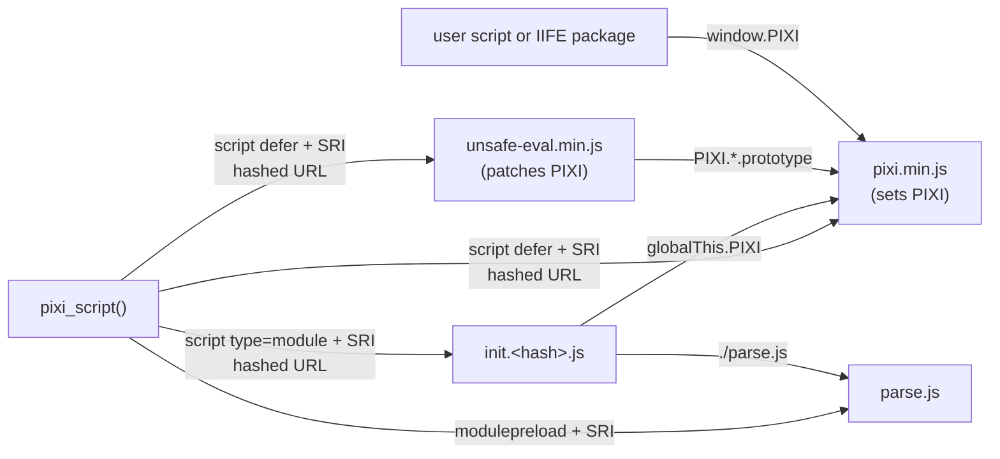

# ADR 0001: Load the PixiJS IIFE build and use the global `PIXI`

- Status: accepted
- Date: 2026-10-07
- Applies to: autumn-plugin-pixijs 0.1.0, autumn-web 0.8.0

## Context

PixiJS 8.22.0 ships two browser builds:

- `dist/pixi.min.mjs`: an ES module. Community packages import it with the
  bare specifier `pixi.js`. A bare specifier needs an import map, and an
  import map is an inline script. The default Autumn CSP
  (`script-src 'self'`) blocks inline scripts.
- `dist/pixi.min.js`: an IIFE. It sets the global `PIXI`.

PixiJS calls `new Function` unless the `unsafe-eval` package patches it
(see ADR 0002). The browser build of this package
(`dist/packages/unsafe-eval.min.js`) is an IIFE. It patches the global
`PIXI`. It has no ES module form in `dist/`. Community packages (filters,
sound) also ship IIFE builds that use the global `PIXI`.

## Decision

- Vendor `pixi.min.js` and `unsafe-eval.min.js` with no changes. A
  `sha384` pin locks each file.
- `pixi_script()` loads both files as classic `defer` scripts at hashed
  URLs, with SRI. It then preloads `parse.js` and loads `init.js` as a
  module script, with SRI.
- The browser runs `defer` scripts and module scripts in document order
  after parsing. Thus `PIXI` exists and has the patch before `init.js` runs.
- `init.js` reads `globalThis.PIXI`. The handle and `pixi:ready` give the
  same object to custom code.

## Consequences

- No import map and no rewrites. The vendored bytes are the upstream bytes.
- One PixiJS instance per page. IIFE community packages work after
  `pixi_script()`.
- The page has one global name: `PIXI`.
- User ES modules cannot `import ... from "pixi.js"`. They use the global.
- `parse.js` gets SRI only from `<link rel="modulepreload">`. Browsers
  without it (Safari before 17, Firefox before 115) import `parse.js` with
  no SRI check. The bytes are same-origin bytes from the binary.
- During a rolling deploy, a page from version N can get the plain URL of
  `parse.js` from version N+1. The SRI check then fails, and the stages
  show their fallback until the page reloads.
