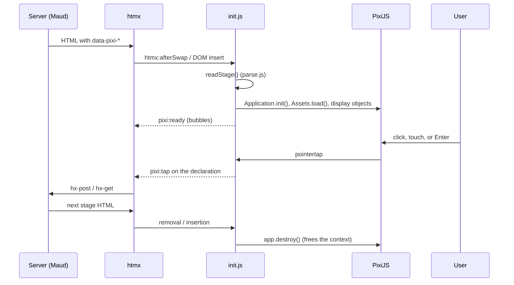
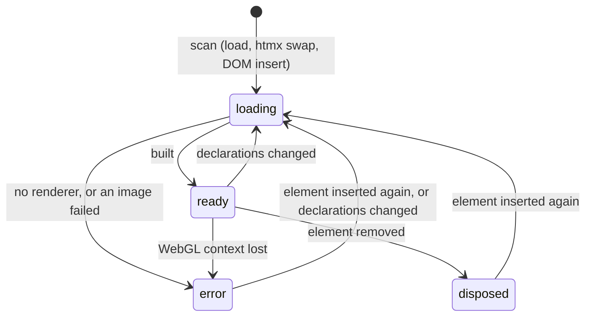

# ADR 0003: Declarative stages with child declarations and a freeing runtime

- Status: accepted
- Date: 2026-10-07
- Applies to: autumn-plugin-pixijs 0.1.0

## Context

Autumn renders HTML on the server. htmx swaps HTML fragments. A PixiJS
application is a JavaScript object graph. With WebGL, it holds a GPU
context. Browsers allow about 16 WebGL contexts per page. A swapped-out
stage that is not destroyed leaks its context.

Server code needs stable coordinates. The element size changes with the
screen.

## Decision

- A stage is one element: `
`. Stage options are
  attributes on it.
- Each display object is a hidden child declaration (`data-pixi-sprite`,
  `data-pixi-tiling`, `data-pixi-sheet`, `data-pixi-text`,
  `data-pixi-shape`). Later declarations draw on top. Text is the element
  content, so an htmx swap can change it.
- Coordinates use a logical stage size (default `800 × 450`). The runtime
  sets the element aspect ratio to this size and scales one root container
  to the element. Objects center on their position by default.
- `parse.js` is pure and never throws. Node tests cover it. `init.js` turns
  the config into PixiJS objects.
- `init.js` scans on `DOMContentLoaded`, on `htmx:afterSwap`, and on DOM
  insertion (`MutationObserver`). A `Map` from element to state prevents a
  second build.
- The runtime builds a stage again when a declaration is added or removed,
  when a watched attribute or the text of a declaration changes, when a
  stage attribute changes, or when its canvas is removed.
- A stage that failed stays failed (a `WeakSet` parks it). It builds again
  only when it leaves the document and comes back, or when its
  declarations change.
- Removal frees the stage: `app.destroy()` loses the WebGL context. The
  asset cache keeps textures for other stages.
- A tappable object gets `eventMode = "static"` and the PixiJS
  accessibility layer (a focusable button with the label). A tap sends a
  bubbling `pixi:tap` event from the declaration element. Thus an htmx
  attribute on the declaration (`hx-trigger="pixi:tap"`) sends a request.
- The ticker runs only while the stage is visible, has motion, and motion
  is allowed. Otherwise frames render on demand. `AnimatedSprite` does not
  use the shared ticker.
- Renderer: WebGL, then Canvas 2D (`auto`). `canvas` uses no WebGL
  context.

## Consequences

- Stages work in any htmx swap with no extra code.
- Server-driven canvas: a tap can return the next stage.
- A change rebuilds the whole stage. The asset cache makes this fast, but
  custom objects from `pixi:ready` code must be added again (the new
  `pixi:ready` event fires).
- Keyboard users reach tappable objects with Tab.
